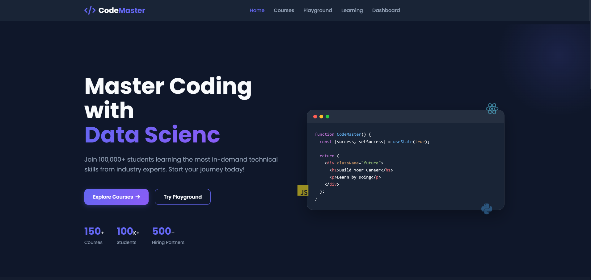
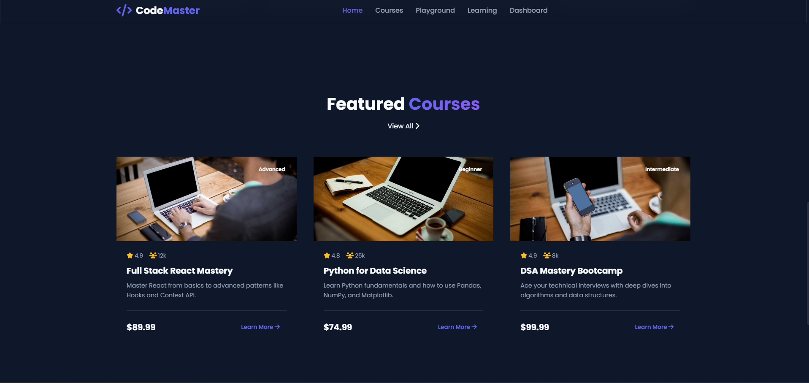
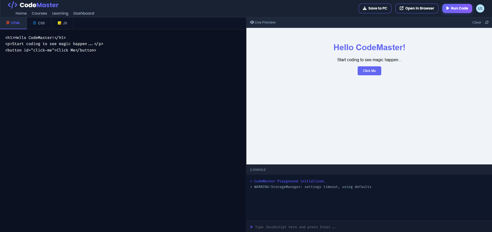

# CodeMaster | Advanced Learning Platform

CodeMaster is a professional-grade, modern, and feature-rich coding learning platform. It is designed to provide an immersive educational experience with a focus on interactive learning and high-performance UI/UX.

---

## 📸 Platform Overview

| **Landing Page** | **Course Exploration** |
|:---:|:---:|
|  |  |

| **Coding Playground** | **Video Learning** |
|:---:|:---:|
|  |  |

| **Student Dashboard** | **Interactive Quiz** |
|:---:|:---:|
|  |  |

---

## 🏗️ Architecture & Design

CodeMaster is built using a **Modular Multi-Page Application (MPA)** architecture. This approach ensures:
- **Clean Separation of Concerns**: Each feature (Dashboard, Playground, etc.) has its own dedicated logic and styling.
- **Optimized Performance**: Assets are loaded only when needed for specific pages.
- **Scalable Component Logic**: Even as a vanilla JS project, it utilizes modular scripts to manage complex state transitions and DOM manipulations.

### Key Architectural Pillars:
1. **Dynamic DOM Injection**: Uses JavaScript to simulate a single-page application feel within an MPA structure (e.g., dynamic course filtering and lesson switching).
2. **Persistent State Management**: Leverages `localStorage` for cross-session data persistence (notes, course progress).
3. **Utility-First Styling**: A global CSS foundation combined with page-specific modules for consistent glassmorphism UI.

---

## ✨ Core Features

- **Interactive Landing Page**: Dynamic typing effects, animated counters, and AOS (Animate On Scroll) integration.
- **Advanced Course Catalog**: Real-time filtering and sorting system for a large catalog of technical courses.
- **Integrated Coding Playground**: A full-featured editor for HTML, CSS, and JS with a live iframe preview and a custom JS Console/REPL.
- **Smart Learning Interface**: Professional video player with synchronized lesson lists and persistent note-taking.
- **Gamified Dashboard**: Visualized progress analytics using `Chart.js`, achievement badges, and streak tracking.
- **Assessment System**: Interactive quizzes with countdown timers and instant performance feedback.

> [!NOTE]
> **Prototype Status**: Some features like the student dashboard analytics, user profile stats, and specific course details are currently using **hardcoded mock data** to demonstrate the intended production UI/UX.

---

## 🛠️ Technologies Used

- **Frontend Core**: HTML5, CSS3 (Modern Flexbox/Grid), JavaScript (ES6+)
- **Visual Enhancements**: [AOS](https://michalsnik.github.io/aos/) (Scroll animations), [Font Awesome](https://fontawesome.com/) (Iconography)
- **Data Visualization**: [Chart.js](https://www.chartjs.org/) (Dashboard analytics)
- **Utilities**: [JSZip](https://stuk.github.io/jszip/) (Playground export feature), [Google Fonts](https://fonts.google.com/)

---

## 🏗️ Project Structure

```
CodeMaster/
├── css/              # Page-specific modular stylesheets
├── js/               # Interactive logic & dynamic data
├── pages/            # Feature-specific HTML modules
├── assets/           # Media, iconography, and screenshots
└── index.html        # Main platform entry point
```

---

## � Getting Started

1. **Clone the Repository**:
   ```bash
   git clone https://github.com/yourusername/CodeMaster.git
   ```
2. **Launch**: Open `index.html` in your browser (Recommended: Use VS Code Live Server for the best experience).
3. **Explore**: Navigate through the courses, try the playground, and complete a quiz!

---

## 📄 License
Distributed under the MIT License. See `LICENSE` for more information.

---
Built with ❤️ for the Developer Community
